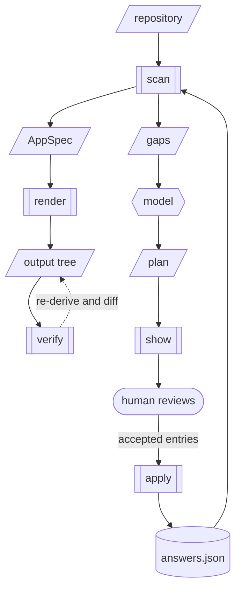

> Establishes the core architecture: deterministic scripts that read an application
> repository into an intermediate representation and render declarative configuration from
> it, a typed gap for everything they could not determine, and a plan/apply cycle that is
> the only path by which a model may influence the output.

## Problem

An application built on a hosted app platform has no deployment definition. The platform
supplies the container build, the routing, the TLS, the environment variables and the
database, and none of it is expressed in the repository. The source code is portable; the
deployment is not.

A team that needs to leave — for cost, or because a compliance requirement says data must
live in a particular jurisdiction — has to reconstruct all of it by hand. In practice that
means writing a Dockerfile per service, working out which environment variables the app
actually reads, deciding how the database is going to run, writing Kubernetes manifests
and the GitOps wiring to deliver them, and discovering the gaps by watching pods fail.

It is roughly a week of undifferentiated work, it is done from scratch by every team that
does it, and the parts that are hard to get right — health probe paths, which env vars are
secret, what the database connection actually needs — are exactly the parts that produce
confusing failures at 2am rather than clear ones at build time.

There is no shortage of tools that deploy an app once it is already described. There is
very little that produces the description.

### Two ways a generator can be wrong

Anything that reconstructs a deployment definition by reading code fails in two distinct
ways, and they need different machinery.

**It does not know.** The repository does not say which port the API listens on, or
whether the database should run in-cluster. This is the tractable case: the tool can
report it.

**It is confident and wrong.** Static analysis fails silently. A health detector matches
`@router.get("/health")` and records the probe path at high confidence, but the router is
mounted with `app.include_router(router, prefix=settings.api_prefix)` and the real path is
`/api/health`. The generated liveness probe 404s, the pod never becomes ready, and nothing
objected — a probe pointing at a path that does not exist is a perfectly valid `httpGet`,
so schema validation passes, and a golden-file test locks the wrong answer in and defends
it against correction.

The second failure is the harder one, and the reason a model appears anywhere in this
design. It is also why the model is confined to proposing data rather than producing
output: the mechanism that catches a wrong detection must not be able to introduce a wrong
generation.

## Proposal

Five deterministic scripts and one model-produced artifact between them.



Double-bordered boxes are scripts and parallelograms are the artifacts between them. The
cylinder is the one file committed to the user's repository, and the hexagon is the only
step a model performs — everything reachable from `AppSpec` to the output tree is
deterministic.

`scan`, `show`, `apply`, `render` and `verify` are pure functions with golden tests. `plan` is the
only artifact a model produces, it is typed and schema-validated, and it is data rather
than an action. The shape of the middle is a compiler's: many front ends, one IR, many back
ends. Adding a source platform is a detector; adding a deployment target is a renderer.
The combinations do not multiply.

`render` runs before any model does. A user gets a complete output tree on the first
command, with unresolved gaps marked in it, and the plan/apply cycle improves that tree
rather than gating it.

### AppSpec

The IR. Everything detected, nothing rendered. A plain data structure, serialisable to
JSON, with a versioned schema.

```
AppSpec
  name          str?                # git remote, or a blocking gap. Never the
                                    # checkout directory — that made 10 of 15
                                    # files depend on the clone path.
  source        { platform, repo_url, commit }   # provenance; never answerable
  services      [Service]
  datastores    [Datastore]
  routes        [Route]
  environments  [Environment]
  delivery      Delivery            # destination inputs; none are detectable

Service
  name          str                 # identity: answers key on this, never on index.
                                    # Derived from the build context directory. Never
                                    # answerable; changing the derivation is breaking.
  role          web | api | worker | cron
  runtime       { language, version }
  build         { context, dockerfile?, install_cmd, build_cmd?, start_cmd?,
                  output_dir? }     # no args: a build arg is an EnvVar
  ports         [int]               # empty if the renderer owns the port
  probes        [Probe]             # liveness | readiness | startup; not one health
  env           [EnvVar]
  resources     { requests, limits }
  replicas      int

EnvVar
  name          str
  source        literal | datastore | platform   # provenance only
  binding       runtime | build_arg
  sensitive     bool                # apply and secretKeyRef key on this
  value         str?                # literal / answered value; never a secret

Probe
  role          liveness | readiness | startup
  path          str
  port          int
  kind          http | tcp

Datastore
  name          str                 # identity; kind alone collides
  kind          mongodb | postgres | redis | ...
  version       str?
  mode          in_cluster | managed | external   # never defaulted
  consumed_by   [service_name]
  env_keys      [str]

Route
  host          str?
  path          str
  service       str
  port          int?                # null = wire to the Service's named port
  tls           bool

Environment
  name          str
  namespace     str?
  replicas      {service: int}?
  resources     {service: ...}?

Delivery
  image_registry    str?
  image_tag         str?            # per-build; CI answers it, see below
  gitops_repo_url   str?
  ingress_class     str?
  target_cluster    str
```

The AppSpec must be able to hold every input the renderers consume, including the ones
that describe the destination rather than the application. A field that cannot be pointed
at cannot be a well-formed gap and cannot be answered.

`EnvVar.binding` exists because the first scenario breaks without it. A Vite or CRA
frontend reads its API base from `VITE_API_URL` or `REACT_APP_BACKEND_URL`, and both are
substituted into the JavaScript bundle at build time. Rendering them as a `ConfigMap` and
a Deployment `env:` block is a no-op against a container serving static files: the bundle
still contains the platform URL, every check passes, and the migrated frontend talks to
the platform the user just left. `binding: build_arg` is an `EnvVar` the renderer reads
when it writes the Dockerfile. There is no second home for that fact.

`source` is provenance. `sensitive` is the security axis. One enum cannot say "this
comes from the datastore" and "this is a credential" at the same time: `MONGO_URL` is
both, and a guard keyed on `source == secret` would miss the one value it most needs
to protect. `apply` and the renderer's `secretKeyRef` both key on `sensitive`.

A `build_arg` is public by construction — it is compiled into a file served to every
browser — so it is never `sensitive`. If one *is* a real secret, the gap says "this is
already public", not "rotate before cutover".

Two rules keep the boundaries honest: **detectors never write files, renderers never read
the source repository.** Wanting to break either one means the AppSpec is missing a field.
Adding the field is the fix.

### Detectors

Each detector answers one narrow question and contributes facts. They compose; they do not
coordinate. A detector that cannot determine its answer emits a gap rather than a default.

For the first scenario the set is: runtime and version, dependency manifest, install
command and whether the transitive set is pinned, service entrypoint and port, health
probes, environment variable usage and binding, datastore identification, committed
credentials, and static frontend build output.

**Detectors walk the service tree.** Looking only at `server.py` (or any single entry
file) is a bug. Real Emergent backends put routes, env reads and helpers under
`routes/`, `services/` and `security/`. A detector that parses one module reports a
confident, incomplete AppSpec — one environment variable, no routes, no probe — and
`kubeconform` is satisfied. That is the "confident and wrong" failure from the Problem
section, produced by the tool this RFC describes.

The walk excludes `node_modules`, `.venv`, `venv`, `build/`, `dist/`, `.git` and
`__pycache__`. Excluding only `node_modules` will treat a dependency's example `.env`
as the user's committed credential.

Datastore identity is taken from *usage* (imports, clients, connection construction),
not from a dependency name alone. `motor` in `requirements.txt` is evidence the app
once used Mongo; it is not evidence it still does. When dependencies and imports
disagree, the detector emits a gap naming both, rather than picking.

### Gaps

A gap is a typed record of something the tool could not determine:

```
Gap
  id            str                 # stable and name-based, "service.api.health.path"
  kind          value | action      # action is acknowledged, not valued
  pointers      [str]               # zero-to-many; JSON pointers into this run
  question      str
  proposed      any?
  confidence    high | medium | low
  severity      blocking | important | cosmetic
  evidence      [str]
  evidence_scope [str]              # path prefixes a citation may be hashed under
  origin        detector | model | stale_answer | orphaned_answer
  depends_on    [Gap.id]            # a later answer may make this moot
```

`id` is the durable identity and the key everything else uses. `pointers` are a per-run
addressing convenience, recomputed on every scan, and nothing may persist them — array
indices are a function of detector output, not of application identity. Gap-to-field is
zero-to-many: a credential value must never enter the AppSpec, and one hostname answer
sets every route.

An `action` gap is not answered by supplying a value. Rotate this credential, commit a
lock file, freeze transitive dependencies: those are acknowledged (`Answer.kind:
action`), not valued. A value-only answers model would re-ask them on every run.

`depends_on` is how a flat list stays honest. `datastore.version` only matters if
`mode` is `in_cluster`; answering `managed` retires it unasked.

A credential found committed in the source repository is a gap of its own, and it carries
one instruction the others do not: **rotate it before cutover, naming the key and the file it
was found in.** This is not a rare case. Of 100 sampled Emergent repositories 27 commit a
working `.env` — the platform's own `.gitignore` has a section headed "Environment files"
that contains no `.env` pattern — and Lovable writes its Supabase URL and key as string
literals into a generated client file. The tool does not refuse to run: the user already has
the problem, and refusing would exclude roughly a third of the population it exists to serve.
But it reads the credential, generates configuration around it, and would otherwise say
nothing — and a migration is the one moment when rotating is natural, because the database is
moving anyway.

Gaps are the product, not an admission of failure. They are emitted as JSON for machines
and rendered for a human to read. A `blocking` gap means the output will not work until a
human answers. Until the generated runbook exists — deferred past v1 — the gap report is the
only place the non-declarative work is described, which raises the bar on how a gap is
worded: it has to be enough for someone to act on alone.

### Plan — the model's only output

A plan is a typed changeset proposing values for the AppSpec. It is produced by a model and
consumed by a script.

```
Plan
  basis         { appspec_sha256, repo_commit, detectors_version }
  entries       [PlanEntry]

PlanEntry
  target        str                 # a Gap.id or a detected-fact id declared
                                    # answerable — never a pointer
  kind          resolve | override
  current       any?                # value at plan time; a compare-and-swap precondition
  proposed      any
  rationale     str                 # why, in plain language, for the human reviewing
  evidence      [{path, line, sha256}]
                                    # hashed by show; apply refuses drift.
                                    # Citations outside the gap's evidence_scope
                                    # are shown as context, never hashed.
  confidence    high | medium | low
```

`kind` separates the two failure modes from the Problem section, because they carry
opposite risk and must not be reviewed at the same rate:

- **`resolve`** supplies a value where a gap exists. `scan` already admitted it did not
  know, so almost any answer is an improvement on a blocking gap. Low risk.
- **`override`** contradicts a fact a detector asserted. This is the model overruling
  deterministic analysis, and it is the only path by which a model can make correct output
  wrong. Acceptance is typed — an override accepted as a resolve is rejected — so
  overruling a detector is an act a script can check, not one a prose file describes.

**Address space.** A plan may only target ids a detector or gap declares answerable.
Schema validation is type-level and would happily accept `/services/0/name` — renaming
every generated file and every ArgoCD application — or `/source/commit`, falsifying
provenance. The answerable set is declared, not inferred.

Declaring it is not sufficient on its own, because nothing would stop a later detector
declaring one of those very fields — "the detected service name is wrong" is a real
complaint. So the exclusion is an invariant, on the same footing as the secret rule below:
**`AppSpec.source` in its entirety, and any field used to construct a stable id —
`Service.name` above all — are never answerable by any detector.** A detector that declares
one is a bug, and the schema check rejects it.

**Basis.** `apply` recomputes the AppSpec hash and refuses a plan whose basis no longer
matches, with no override flag: re-scan and re-plan. Terraform's saved plans are bound to a
state serial for the same reason, and the shape is worthless without it. A plan that
proposes `/services/0` while a teammate adds a worker service would otherwise write the
API's probe path onto the worker, type-check cleanly, and persist both failures.

The vocabulary is Terraform's deliberately. The mapping that matters holds: `plan` writes
nothing and is the artifact to read carefully, `apply` is what commits, and `show` renders a
plan for review. It is imperfect — Terraform's plan is the deterministic step and here it is
the only nondeterministic one — but the scrutiny it directs is at the right place.

### Show

`show(plan, appspec) -> text` renders a plan for a human to review: entries grouped by
`kind`, overrides first and marked as contradicting a detector, each with its rationale, its
evidence, and the value it would replace.

It is a script for the same reason the renderers are. Reviewing the plan is the one moment a
human decides whether a model's judgement enters the output, and if the surface they read
were model-authored, the layer this RFC is careful to keep out of output content would be
composing the argument for accepting it.

### Apply

`apply(appspec, plan, answers, accepted_resolves, accepted_overrides, now) -> answers'` is
a pure function. The
clock is an argument supplied at the edge, never read inside — the same rule AGENTS.md §3
applies to renderers.

It rejects an entry when: the basis does not match; `current` differs from the live value
(compare-and-swap); an entry with `kind: override` was accepted as a resolve; the target is
outside the declared answerable set; two entries target
the same id or nest; the cited evidence does not resolve to a real file and line range,
or its hash has drifted since `show` stamped it; or the target is an `EnvVar` whose
`sensitive` flag is true.

That last rule matters more than it looks. The answers file is written to the user's
repository and committed. Without the rule, the natural reading of "supply the value the
tool could not determine" walks a user into pasting a live database password into a file
they are then told to commit. Secret *values* never enter an answer, per AGENTS.md §4;
an answer may say where a secret comes from, never what it is. Keying the guard on
`source == secret` is not enough: a connection string is `source: datastore` and
`sensitive: true`.

`show` is what hashes evidence. A model cannot hash a line by hand and should not be
asked to. `apply` compares the stored hash to the bytes on disk at apply time; a line
that changed between review and apply is a rejection. The basis check does not cover
this — a dependency bump moves no AppSpec field. Those are two surfaces.

Citations outside a gap's `evidence_scope` are kept as `Answer.context`: shown to the
reviewer, never hashed, never a reason to re-ask. Padding a citation list with
`frontend/src/App.css` must not become a permanent re-ask trigger for a question about
Python. Reasoning across the repository is what a model is for, so out-of-scope
citations are not rejected outright.

Stored answers stay in the declared address space. Deriving the set from *open* gaps
means answering a gap retires it, and a later plan that revises the answer is rejected
as out-of-address-space. The only remaining edit path would be the file this machinery
exists to keep hand-editing out of.

### The answers file

The accumulated, accepted result of applied plans. It lives in the user's repository,
is reviewed in a diff, and is a deterministic input to `scan` on the same footing as the
source tree. It is what stops the second run re-asking everything. The file is JSON,
not YAML: it is rewritten by the tool and must be byte-stable across versions, and YAML
has many valid serialisations of the same data.

"Accepted" is wider than "human-accepted". CI answers `Delivery.image_tag` on every
build (`Answer.accepted_by: ci`). The distinction stays visible so a reviewer can still
see which answers a person decided.

```
AnswersFile
  version       int                 # 1. Bumped on any breaking change to this format.
  answers       [Answer]

Answer
  target        str                 # the stable id
  kind          value | action
  value         any?
  detected      any?                # from the bare, pre-merge AppSpec — never the live one
  evidence      [{path, lines, sha256}]
  context       [{path, line}]      # shown, never hashed
  accepted_by   human | ci          # default human; adding it does not bump version
  detectors_version str
```

`Answer.detected` and a plan entry's `current` look like the same value and are not.
`current` is the compare-and-swap precondition: what the human reviewed, which after a
merge is a previously-answered value. `detected` is what the detector produced when
this was answered. Filling `detected` from the live AppSpec records an answer as though
a detector had produced it, and every later scan then reports the real detector as
disagreeing. `scan` writes a `detected.json` sidecar from the bare, pre-merge spec;
`apply` reads that.

The file carries a format version from the first commit, and `scan` hard-fails on a version
it does not recognise rather than attempting a migration. The AppSpec deliberately carries
no version: it is derived, regenerated on every run, and breaking it freely is the point of
being pre-release. The answers file is the opposite — it is committed to other people's
repositories and outlives every version of this tool, so a v0.3 file silently mis-merged by
v0.9 would be the exact failure the machinery below exists to prevent, arriving through the
one door that machinery does not watch.

**Precedence and invalidation are the load-bearing part of this design.** "Answers win
over detection" is the obvious rule and it is wrong: it makes one accepted answer permanent,
silences the detector that would later correct it, and reintroduces the confidently-wrong
failure in a stickier form — because now gap count *falls* when it happens. A stale answer
is invisible to every check in this document.

The rule is therefore:

> A live detector value that disagrees with a stored answer never wins silently, in either
> direction. It becomes a gap.

`scan` merges an answer when one of these holds:

- The detector still produces the value recorded in `detected` (or still produces
  nothing, when `detected` is null) **and** every cited evidence range hashes to what
  was recorded.
- The detector now produces *exactly* the stored answer. Agreement wins. The answer
  merges and is reported under "answers a detector has caught up with" — a note, not a
  gap. Action answers are excluded, since they carry no value.

Otherwise the answer is not merged: it is re-emitted as a gap with `origin:
stale_answer`, carrying both the stored answer and the new detected value, which the
model turns into an ordinary plan entry for a human to confirm.

The second bullet is the correction that keeps graduation from taxing the improvement.
The letter of "detected must still match" re-asks when a detector moves from null to
the value the human already gave. Measured on the spike fixture, graduating `app.name`
raised the answered gap count from 0 to 3, two of them with identical values on both
sides. That is the same metric inversion this section already rejects, with the sign
flipped: a detector getting better raised the count. A stream of questions where both
sides read identically is how a reviewer learns to click through.

Agreement also overrides the evidence test: a detector producing the value *is* the
evidence, and the human's citation no longer has to hold. If the detector later moves
to a *different* value, that disagreement is still a `stale_answer` gap.

Orphaning is resolved against the **AppSpec**, not the gap list. Resolving against
open gaps turns every graduation into an orphan, because a gap disappearing is also
what success looks like. If the answer's target no longer exists in this run's
AppSpec — a service renamed, a service removed — the answer is re-emitted as a gap
with `origin: orphaned_answer`, carrying the stored value and the ids that do exist.
It is never silently dropped.

This is why `Service.name`'s derivation is fixed by this RFC rather than left to a
detector. Changing it renames every service at once and orphans every answer in every
user's repository, which makes it a breaking change requiring a superseding RFC.
`AppSpec.name` gets the same care: it is taken from the git remote, or it is a
blocking gap. It is never derived from the checkout directory.

Evidence is hashed by cited line range rather than by whole file. Hashing
`backend/server.py` would invalidate every answer that cites it on every unrelated
commit, which is the re-asking the answers file exists to eliminate.

### Renderers

Each renderer turns an AppSpec into a directory of files for one target. Renderers are pure
functions and their output is byte-stable.

The first target is Kubernetes delivered by GitOps, emitting the conventional Kustomize
layout — a `base/` holding the manifests and per-environment overlays that patch image,
resources and environment-specific values — plus the GitOps `ApplicationSet` that points at
each overlay, and a Dockerfile per service that does not already have one.

The layout is deliberately conventional rather than novel. The output should look like
something a competent platform engineer would have written by hand, because a human has to
review it, own it, and modify it for the next five years.

**Existing deployment artifacts are not overwritten.** v1 is greenfield for the
*deployment repository* the tool scaffolds. The *source* repository often already has
a `Dockerfile`, a `Procfile`, or a `deploy.sh` — the first real Emergent repo the spike
ran against had all three. Full adopt mode (inferring conventions from an existing
Kustomize tree) stays out of scope. The v1 rule is narrower: if a service already has
a Dockerfile, the detector records that path on `Build.dockerfile` and the renderer
does not emit a second one. If the existing file and the file the renderer would have
written diverge, that is a gap naming both, not a silent extra file.

**`Delivery.image_tag` is a per-build fact.** The honest answer is "whatever CI just
built". Standard GitOps has CI write the new tag into the manifests and commit, and
that collides with `verify`'s invariant. The resolution is to keep the field and have
CI answer it: `scan → one-entry plan → apply --accepted-by ci → scan → render →
commit`. The tag is then a genuine AppSpec change, `verify` stays green with no
carve-out, and no model or key is involved. An immutable tag is also what makes
`imagePullPolicy: IfNotPresent` correct rather than dangerous; the two are coupled.

**A datastore's `mode` is never defaulted.** Whether a database runs in-cluster, on a managed
service, or against something the team already operates is a decision about cost, operations
and risk — nothing in a repository can answer it, and a tool that picks has made an expensive
choice on the user's behalf without saying so. The gap is `blocking` with no `proposed` value,
and no datastore manifest is emitted for any mode.

This costs less coherence than it appears to, because the *service* side of the rendering is
identical under all three modes. Per AGENTS.md §4 a connection string is emitted as a
reference — a `secretKeyRef` — never a value, and that reference is the same whether the
string ends up pointing at a StatefulSet in the next namespace or at a managed cluster three
regions away. So the application manifests render complete and correct; the only thing absent
is the database itself, which is the only thing the user has not decided. A pod that starts
before the decision is made fails with `secret "..." not found`, which names the missing
input, rather than with a DNS timeout against a Service that was never going to exist.

The gap states what each mode would require and what the user must do for whichever they
choose. Once the generated runbook exists those steps move into it; in v1 the gap carries
them.

### Verify — and why the output tree is not honour-system

`render` writes `.offramp/manifest.json` alongside its output: for every emitted path, the
SHA-256 of the bytes it wrote and the AppSpec revision that produced them.

`verify` re-renders into a temporary directory and diffs against what is on disk. It is a
script, it needs no model, and it enforces the invariant this whole design rests on:

> Every byte under the output tree is a pure function of (AppSpec, answers, renderer
> version). A non-empty verify diff is a bug report against a renderer, never something to
> reconcile by editing the output.

Without it the central safety claim is unenforceable. A model running a skill has ordinary
write access to every file it just produced, and when a probe path is wrong the cheap fix is
to edit `base/api-deployment.yaml` while the expensive one is to propose a plan entry, get
it accepted, apply, and re-render. The wrong output validates — `kubeconform` is satisfied
by a probe pointing nowhere — so nothing else in the design would notice. The same manifest
lets `render` refuse to clobber a file whose on-disk hash has changed, reporting it as a
conflict instead of destroying a user's hand edits on the second run.

`verify` lands in the same change as the first renderer — it cannot be tested before
something renders — and must be green before a second renderer, before `apply`, and before
the skill.

**The skill runs it as its mandatory last step.** That is the whole enforcement story for
v1: no emitted CI workflow, no git hook, nothing installed in the user's repository. A user's
own hand edits are protected by a different mechanism — `render` refuses to overwrite a file
whose on-disk hash no longer matches the manifest — so `verify` only has to police the actor
that could otherwise finish a session with an unexplained output tree, which is the model.

### Surfaces

The distribution surface is a **skill**: an instruction file that orchestrates, plus a
bundled directory of deterministic scripts that decide.

```
skills/offramp/
  SKILL.md        orchestration: which script to run, when to ask a human
  scripts/        scan, apply, render, verify — the whole product
```

The governing rule, in the form that can actually be reviewed against:

> **No byte of the output tree may be produced by anything except a renderer script reading
> the AppSpec. The model may propose AppSpec field values, and nothing else.**

The earlier phrasing — "SKILL.md must not determine output content" — does not survive
contact: the model's `proposed` values and its `rationale` prose do influence what a human
accepts, and therefore output bytes. The rule above is narrower and forbids the tempting
shortcut it is aimed at, which is writing target configuration by hand because the renderer
for it does not exist yet.

Choosing a skill over a CLI-first build order is a decision about who the user is. They are
already inside a coding agent; a skill is installable today; and it collapses four surfaces
into one before a single detector exists. **The scripts remain the product.** They take
paths and files, not conversations, so `scan`, `render` and `verify` run unattended in CI
with no model and no key — which is what keeps the quality metric below measurable, and
what a library, a CLI or an MCP server can be layered onto later without redesign.

### Gap count is the quality metric, measured twice

Every fixture run records gap count by severity. Falling gap counts on a fixed corpus is
the definition of the tool improving.

`scan` now takes two inputs, so the number must be qualified or it becomes gameable — a
contributor whose change trips the gate could accept a plan entry that echoes a gap's own
`proposed` value, and the count would fall with no detector touched and no golden file
moved.

- **Bare gap count** — `scan` run with the answers file absent. This is the headline number
  and the only series CI gates on. It measures detection.
- **Answered gap count** — with answers merged. Tracked, never gating. It measures how far
  one plan/apply cycle gets a user.

For every field a detector is supposed to determine, at least one corpus fixture must carry
no answer for it, so that detection stays under test.

Gap count alone still rewards the wrong thing, because a detector that guesses instead of
emitting a gap improves it, and the golden tree cannot object — it records whatever was
generated. So each fixture also carries `truth.yaml`: the values a human knows to be correct
for that application, written by hand and independent of anything a detector produces. CI
gates on two series — **bare gap count falling**, and **detected facts agreeing with
`truth.yaml` at 100%**. A gap that becomes a confidently wrong fact fails the second even as
it improves the first.

### Scope of the first implementation

- **One scenario:** Emergent — a FastAPI backend, a Create React App frontend, and MongoDB.
  This is *not* the common shape. Surveying 200+ generated repositories, the modal output of
  an app-building platform is a Vite/React single-page app with **no backend in the
  repository at all**, reaching a hosted Supabase; that is Lovable, Bolt and Base44. Emergent
  is the only platform in the set that emits a Python service and a document database, and it
  is first precisely because it is the shape where generating this output is worth doing —
  there is a service to containerise and an ingress to express.
- **One target:** Kubernetes via Kustomize and GitOps. The honest reason is capability
  rather than demand: it is what the maintainers have already solved. A solo founder leaving
  a hosted platform for a data-residency requirement did not ask for GitOps, and later
  targets — Compose, a single-host profile — are likely to suit them better. Naming that now
  keeps a reviewer from inferring a user need that has not been demonstrated.
- **One environment**, `production`, emitted through the full overlay mechanism rather than
  around it, so that adding `staging` later is additive instead of structural. This makes the
  `binding: build_arg` promotion problem moot rather than solved: with one environment the
  frontend's baked API URL is simply correct. When staging arrives the answer is runtime
  config injection — an entrypoint writing `/config.js` — which changes the user's
  application and is therefore a runbook item, not a generated file. Per-environment image
  builds are the alternative and they break build-once-promote-the-artifact; defaulting to
  them silently is the failure this note exists to prevent.
- **Greenfield deployment repo, not a greenfield source repo.** The tool scaffolds a
  deployment repository from an opinionated default. The source application may already
  contain a Dockerfile or Procfile; see Renderers. Inferring conventions from an
  existing Kustomize/Helm tree remains out of scope.
- **Manifests and scaffolding only.** The generated runbook is deferred. v1 emits
  configuration and a gap report; the imperative work stays the user's, described by the
  gaps rather than by a separate document.
- **`kind: resolve` only.** The plan model above is specified in full, but v1 neither emits
  nor accepts `kind: override`. A model that relays a human's answer to a question the tool
  already asked cannot make correct output wrong; a model that overrules a confident detector
  can. Shipping the second requires evidence that detectors are wrong often enough to justify
  it, and that evidence is a gap count from real runs, which does not exist yet.
- **Distribution is clone-and-point.** The skill lives at `skills/offramp/`; there is no
  registry and no install step.
- **Python**, because the first scenario's applications are Python and the ecosystem overlap
  makes detectors easier to write and verify.
- **Build order:** `scan` first; then the first renderer and its manifest, with `verify` in
  the same change; then `show` and `apply`; then the skill. The model is the last thing
  added, not the first.

## Alternatives considered

**An agent with prompt-embedded templates.** Ship a skill that instructs a model to write
the manifests, with example YAML in the prompt. Far less code, and nothing to integrate.

Rejected because the logic ends up living in prose. Nothing validates a template embedded in
a prompt, no test can assert on it, and gap count as a quality metric requires a run that
gives the same answer twice. This RFC keeps the skill as a *wrapper* and puts every byte-
producing decision in a script, which is a different proposal: scripts are testable, and
`verify` proves at runtime that they were the ones that wrote the output.

**A tool that calls a model itself.** Have a detector ask a model when it cannot determine
something. Rejected: it requires network access during generation and an API key as a
precondition for output, and it makes detectors non-deterministic, which ends golden-file
testing. Under the skill design `offramp` calls no model at all — the model already running
calls `offramp`. AGENTS.md §2's prohibition on reading from the network during generation
therefore needs no amendment.

**Letting the model edit the AppSpec directly.** Simpler, and one artifact fewer. Rejected
because the model's output would become an action rather than data: unreviewable as a diff,
unvalidatable against an address space, and impossible to reject entry by entry.

**Answers win over detection.** The obvious merge rule, and one line of code. Rejected
above: it makes a wrong answer permanent and inverts the quality metric.

**Direct generation with no IR.** Read the repository and write files in one pass. Rejected
because the second target reuses none of the first: N×M implementations that drift, against
N+M with the IR.

**Deploying, not just generating.** Rejected for the first implementation and constrained
permanently by `AGENTS.md`.

**Reading the running application instead of reasoning about it.** The strongest alternative
considered. Every FastAPI app serves `/openapi.json`, returning the complete post-mounting
route table — real paths with prefixes already applied. One GET against the URL the user is
migrating away from would answer the health path, the Ingress route list and the
frontend/backend prefix split as a checked fact rather than a judgement, in the case that
static analysis of a settings-derived prefix cannot decide in general.

Rejected, for four reasons that compound.

It is not reliably available: migrations happen after a billing cutoff, after a shutdown, or
from a repository handed to someone who never had access to the running app. A detection
input that is present for some runs and absent for others produces two classes of output
whose quality cannot be compared, and the quality story here rests on a fixed corpus.

It is not reliably public. `/openapi.json` behind authentication means handling a credential
to read it, which reintroduces the secret-handling surface this design otherwise does not
have.

It is framework-shaped. FastAPI serves an OpenAPI document; Express, Django and most
JavaScript backends do not. It would resolve the flagship case for one framework and leave
the detector work to be done anyway for the rest.

And it would narrow the declarative constraint. That constraint's value is that it is
absolute and needs no argument at the boundary; narrowing it once turns every later request
into an argument about degree.

The consequence is accepted rather than wished away: the router-prefix case remains
undecidable by static analysis, and it is what the model surface exists to carry. A related
consequence is an improvement — `truth.yaml` stays hand-written, and ground truth that no
tool generated is better ground truth for testing a tool.

## Impact on generated output

None — there is no existing output. This RFC establishes the baseline that later RFCs will
be measured against.

## Testing

**Golden fixtures, twice over.** Each fixture in `fixtures/` carries an input tree, an
`expected_bare/` rendered with no answers merged, and an `expected_answered/` rendered with
its checked-in answers. `expected_bare/` is the tree that moves when a detector improves and
is where the signal lives; without the split, a fixture whose expected output depends on an
applied answer passes identically whether the detector works or does not run at all.

**Provenance assertions.** Every leaf of the merged AppSpec carries `origin: detector |
answer` in a canonically serialised sidecar. This makes detector graduation mechanically
testable: after adding detector X, assert the provenance for its field flips from `answer`
to `detector` and that `expected_bare/` gains the correct value.

**Staleness, agreement and orphan tests.** Fixtures with an answer whose cited evidence
has moved, and with a detector that now disagrees, asserting a `stale_answer` gap is
emitted rather than the answer being merged; a fixture whose detector graduates to
*exactly* the stored answer, asserting a merge and no re-ask; and a fixture whose
answered service has been renamed away, asserting an `orphaned_answer` gap rather than
a silent drop.

**Ground truth.** Every fixture's detected facts are asserted against its hand-written
`truth.yaml`. This is the assertion that fails when a detector guesses.

**Show is golden-tested.** The review surface a human reads is byte-stable for a given plan,
including the ordering that puts overrides first.

**Apply is a pure function** and is golden-tested as one: `(appspec, plan, answers,
accepted, now) -> answers'`, including every rejection path — bad basis, failed
compare-and-swap, out-of-address-space target, colliding entries, unresolvable evidence, and
an attempt to answer a sensitive EnvVar, evidence that drifted between show and apply,
and an override accepted as a resolve.

**Verify.** A fixture whose output tree has been deliberately tampered with, asserting a
non-zero exit and a diff naming the file.

**Validation of generated artifacts.** `kustomize build`, `kubeconform`, and `docker build`
on generated Dockerfiles. Read-only, touching no real infrastructure. `docker build`
alone is not enough: a generated image that cannot `import` its own entrypoint still
builds. The check that catches that — and a confidently wrong probe — is "the image
starts and answers its own probe path". It still touches nothing real.

**Gap metrics.** Bare gap count by severity is recorded per fixture; an increase in blocking
gaps fails CI unless the authorising RFC says why.

**CI runs no model.** Everything above executes with no API key present. Plan handling is
tested against checked-in plan fixtures, not generated ones.

**Fixtures must be structurally representative.** At least one fixture per scenario
splits routes and environment-variable reads across multiple modules. A single-file
`server.py` will validate every module-scoped detector against a shape real repositories
do not have, and golden tests will lock the wrong answer in. The same fixture set must
include a settings-derived router prefix (the undecidable case the model surface exists
to carry) and a service that already has a Dockerfile.

**Fixtures are generated by the maintainers, not vendored.** Exports are produced on the
platform's own free tier and scrubbed before they are checked in, which gives real output
with unambiguous rights and allows the awkward shapes to be made deliberately — an app with a
worker, one with no health endpoint, one with a committed `.env`, one that is not a
single file. Vendoring public
repositories is not viable: 74% of Emergent repositories and 94% of Lovable ones carry no
licence at all, and pristine exports and permissive licences turn out to be nearly disjoint.

**The recall corpus is referenced, never copied.** Detector hit rates are measured by running
against public repositories that are not checked in and not redistributed, reported in
aggregate. This gives real-world coverage numbers without a licensing exposure, and it is the
only way to learn that a detector matches 90% of what exists rather than 100% of what we
thought to write down.

No customer repository, and no credential, hostname or account identifier in a fixture — not
even an expired one.

## Declarative constraint

This proposal complies, and tightens rather than loosens the constraint.

Every renderer emits files. Nothing in the pipeline calls a cloud API, requires cloud
credentials, or mutates any running system. `offramp` itself makes no network request and
holds no API key: the model runs outside it, in the agent the user is already using, and
reaches the scripts by executing them. The validation steps are read-only and operate on
generated output in a temporary directory.

Two consequences deserve stating rather than inferring. First, `verify` converts the
declarative claim from an honour-system rule into a check anyone can run — it is the only
mechanism in this document that tests whether a renderer actually produced the output.
Second, the skill layout must be brought inside the project's own enforcement: everything
under `skills/` is program text, `SKILL.md` included, and the RFC gate in
`scripts/check_rfcs.py` does not gate `skills/` at all, and adding it to the gated prefixes
would not be sufficient — the `.md` suffix exemption, written when Markdown meant
documentation, would still release `SKILL.md`, the one file that governs the model. The gate
therefore needs a prefix set carrying no suffix exemption. That change lands with this RFC,
not after it.

Work that cannot be declarative — moving data, cutting over DNS, setting a secret value for
the first time — is written into the generated runbook as instructions for a human, with the
commands spelled out. The tool does not run them.

## Out of scope

- **Adopting an existing deployment repository** — inferring conventions from a Kustomize
  or Helm tree the user already has. The more valuable mode for established teams,
  deliberately second. Reusing an existing *source* Dockerfile is in scope for v1; see
  Renderers.
- **Data migration.** Detecting the datastore and generating its deployment is in scope;
  moving the contents is a runbook.
- **Additional targets** — Terraform, Nomad, Compose, managed container services.
- **Additional source platforms.**
- **A library, CLI or MCP server surface.** The scripts are designed to make these additive.
- **Three-way merging of user edits into regenerated output.** `render` detects the conflict
  via the manifest and refuses; reconciling it is the user's, for now.
- **Autonomous verification** against a live or ephemeral cluster. `verify` checks that the
  output matches the renderers, not that it runs.
- **Compliance evidence artifacts.**

## Revisions from the spike

A throwaway branch (`spike/0001-poc`) ran this design end to end against a synthetic
fixture and then against a real Emergent repository. It is not the implementation and
must not be merged while this RFC is in review. The findings that change the design
are folded into the sections above. The ones that matter most:

- The AppSpec as first printed could not render a working application (`EnvVar.value`,
  `sensitive`, `Delivery`, `AppSpec.name`).
- Agreement must merge, or graduating a detector raises the answered gap count.
- `Answer.detected` is taken from the bare spec, not the live one.
- Evidence is hashed by `show` and refused on drift; relevance is `evidence_scope`.
- Detectors walk the service tree. The fixture that kept routes and env reads in one
  `server.py` validated every module-scoped detector against a shape real repositories
  do not have. On a real one the backend detector found 1 of 15 env vars, no routes
  and no probe — and `kubeconform` passed. That is the failure the Problem section
  names.
- v1 reuses an existing source Dockerfile rather than writing a second one. Full
  adopt mode stays out of scope.

Status stays `review`. Implementation stays blocked until this RFC is accepted.

## Open questions

None. The five questions this RFC opened during drafting are resolved in the sections
above, and the spike findings that change the design are absorbed rather than left
open: the answers file carries a format version and the AppSpec does not; a
datastore's `mode` is never defaulted; reading the running application is rejected
under Alternatives; the Terraform vocabulary is kept deliberately; the first
implementation targets a single `production` environment through the full overlay
mechanism; detectors walk the tree; fixtures are multi-module; and an existing
source Dockerfile is reused, not duplicated.
