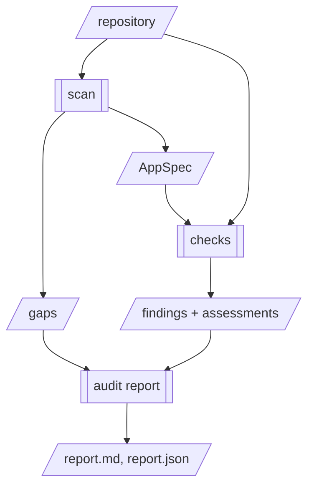

> Reorders the first implementation. Instead of a Kustomize renderer for Emergent, the first
> thing `offramp` ships is `audit`: a read-only report on whether an app-platform repository
> is safe to keep running and what leaving would take. It covers Emergent and the modal
> Lovable shape. The architecture in RFC-0001 stands. This RFC replaces only its *Scope of
> the first implementation* and its build order, and adds one record type, `Finding`.

## Problem

RFC-0001 serves a user who has already decided to leave a platform, and who can run what
the tool emits. By its own account, that is the smaller population and the harder target:

- **It targets the rare shape.** RFC-0001 surveyed 200+ generated repositories and found the
  modal output is *"a Vite/React single-page app with no backend in the repository at all,
  reaching a hosted Supabase"*. It chose Emergent because Emergent is *"not the common
  shape"*, and Kubernetes because it is *"capability rather than demand"*. For the modal app,
  a Kustomize tree has almost nothing to describe. The app is a static bundle, and its data
  and access rules live in Supabase.
- **It needs a platform-literate user.** The output is only useful to someone who has a
  cluster, a GitOps repository and a registry. Most people building on these platforms have
  none of the three.
- **It only helps after the decision.** A renderer's output is worth something once a user
  has chosen to move. Before that point, they cannot use it at all.

The same survey shows that the question these users can't answer today is a different one:
**is the app I have safe to keep running, and what would it take to own it?** The evidence is
already in this repository's own record, and it is not rare:

- 27 of 100 sampled Emergent repositories commit a working `.env` (RFC-0001, *Gaps*).
- Lovable writes the Supabase URL and key as string literals into a generated client file
  (RFC-0001, *Gaps*). The key is public by design. That makes the database's row-level
  security the only access control the app has.
- CVE-2025-48757 is the public record of that access control failing. 170 of 1,645 scanned
  Lovable applications (10.3%) exposed database contents through missing or insufficient
  row-level security.
- A frontend build argument is compiled into a file that is served to every browser
  (RFC-0001, *AppSpec*). A secret that is passed as one is already public, and nothing tells
  the user.

Today a user who wants to know whether any of this applies to them has to read their own
migrations and bundle config with knowledge they don't have. `scan` already computes most
of the facts needed to answer, and then it reports them only as blockers to rendering.

## Proposal

Add an `audit` entrypoint that runs `scan`, evaluates a fixed set of **checks** against the
AppSpec and the repository, and renders a report. The pipeline stays the same, and audit is
one more deterministic consumer of it:



The renderer, `verify`, `show`, `apply` and the skill all remain as RFC-0001 specifies them.
This RFC moves them later in the build order and does not cancel them.

### Findings are not gaps

A gap is something the tool **does not know** that it needs in order to render. A finding is
something the tool **does know** about the application as it runs today. They are different
axes, and the project's quality metric depends on keeping them apart. *Bare gap count
falling* means detection is improving. If findings were counted as gaps, then an app with
more problems would look like a worse detector, and a detector that failed to notice a
problem would look like an improvement.

```
Finding
  id            str                 # stable, name-based:
                                    # "supabase.rls.disabled.public.profiles"
  check         str                 # the check that produced it
  category      security | portability | operability
  severity      critical | high | medium | low
  title         str                 # one line, in the user's terms
  detail        str                 # what, and why it matters in production;
                                    # enough to act on alone
  remedy        str                 # generic; names no vendor, product or service
  evidence      [str]               # path:line, never a value
  related_gaps  [Gap.id]            # e.g. the rotate-before-cutover gap

Assessment
  check         str
  status        found | clean | not_applicable | could_not_assess
  reason        str?                # required unless status is found or clean
```

`severity` is deliberately a different scale from gap severity. `blocking` asks "will the
output work?", while `critical` asks "is someone exposed right now?". The code never maps one
onto the other.

**Every check emits an `Assessment`, including the checks that find nothing.** A clean
report is a claim, and it must show what it checked. A check that could not parse a
migration, or that has no evidence to work from, reports `could_not_assess` with a reason.
It never reports `clean`. This is RFC-0001's gaps-over-guesses rule applied to the audit: an
unknown is reported as an unknown.

The committed-credential detector keeps emitting its `action` gap, which is the
rotate-before-cutover instruction RFC-0001 requires. It now also emits a Finding with
`related_gaps` pointing at that gap. The two records describe different things: the gap is
a step in a migration, and the finding is a risk in production today. The report shows the
finding once and links to the gap. Gap counts do not change.

### Checks in the first implementation

Each check is a pure function `(appspec, repo_view) -> (findings, assessment)`, registered
in one table with its id, category and the scenarios it applies to. `repo_view` is the
read-only walk from `walk.py`, and checks read files only through it.

| Check | Category | Severity | Fires when |
|---|---|---|---|
| `credential.committed` | security | critical | The existing detector's condition. Reuses it; no new detection. |
| `frontend.secret_in_bundle` | security | critical | An `EnvVar` with `binding: build_arg` has a name that `is_sensitive` accepts, or frontend source contains a Supabase key whose JWT payload role is `service_role`. |
| `supabase.rls.disabled` | security | critical | A table created in `supabase/migrations/` never has `enable row level security` applied in any later migration, and is not dropped later. |
| `supabase.rls.permissive_write` | security | high | A policy for `insert`, `update`, `delete` or `all`, granted to `anon`, `public` or `authenticated`, has a `using` or `with check` clause that is literally `true`. |
| `supabase.rls.public_read` | security | medium | A `select` policy granted to `anon` or `public` is `using (true)`. It may be intended; the finding asks the user to confirm. |
| `platform.hardcoded_url` | portability | medium | Source contains a literal URL on a platform-owned domain. These URLs break silently after a move. |
| `service.no_health_endpoint` | operability | low | A backend service has no health route, reusing the probe detector's gap condition. |

Notes that bound these checks:

- **Migrations are replayed in filename order.** A table whose RLS is enabled three
  migrations later is clean, and a dropped table is not reported. The replay tracks only
  `create table`, `alter table … enable row level security`, `drop table`,
  `alter table … rename`, `create policy` and `drop policy`. A migration it cannot parse
  makes the whole check `could_not_assess` for that repository. It never produces a
  partial answer.
- **Dashboard changes are invisible, and the report says so.** A policy created in the
  Supabase dashboard never appears in `supabase/migrations/`. For this reason every report
  includes a fixed, per-scenario **"not visible from the repository"** section. It lists
  row-level security and policies changed outside migrations, auth settings (open sign-up,
  email confirmation), backups and point-in-time recovery, storage bucket policies, and who
  has access to the platform account. It points to the platform's own tooling for each,
  such as Supabase's security advisor. This section is static text, and it is the report's
  most honest part.
- **The anon key is not a finding.** It is public by design. The report explains that it is
  safe only when row-level security is correct, and that is why the RLS checks exist.
- **Decoding a JWT is local.** It is a base64 decode of the payload. It reads no network, the
  value never leaves the check, and evidence is `path:line` only.
- **Platform domains and platform-coupled dependencies are data.** They live in one file,
  and each entry is confirmed against the recall corpus before a check depends on it. Nothing
  enters that file from memory of how a platform worked at some point.

### The Lovable scenario

`audit` needs the modal shape, so this RFC adds the Lovable scenario to `scan`, limited to
what the checks consume:

- a Vite service detector (`role: web`, build output, `VITE_*` env reads as `build_arg`)
- a Supabase detector: the client file, `supabase/config.toml`, `supabase/migrations/` and
  `supabase/functions/`, recorded as a `Datastore` with `kind: postgres` and
  `mode: external`, plus the migration set that the RLS checks replay
- edge functions under `supabase/functions/` are recorded as present, with their
  `Deno.env.get` reads, but they are not modelled as services yet

Detectors follow RFC-0001 unchanged. They walk the tree, they have no model and no network,
and they emit gaps rather than defaults.

### Output

```
python skills/offramp/scripts/audit.py <repository> --out <directory> [--fail-on high]
```

It writes two files and nothing else:

- `report.json` is the findings, assessments and the relevant gaps, as canonical JSON with a
  versioned schema.
- `report.md` is the same content for a person to read. It renders on GitHub, so a user can
  commit it or paste it.

The exit status is `0` when no finding is at or above `--fail-on` (default: none, so the
command always exits `0`), `1` when one is, and `2` when the tool fails. That makes it
usable as a CI step with no extra surface.

The report is byte-stable. It carries the source commit from `AppSpec.source` in place of a
timestamp. Findings are ordered by severity, then by id. An abridged example:

```markdown
# Readiness audit: widgets (lovable, a1b2c3d)

critical: 2  high: 1  medium: 1  low: 0 · 7 checks: 4 found, 2 clean, 1 could not assess

## critical

### supabase.rls.disabled.public.orders
Table `public.orders` has no row-level security. Anyone with the app's public key —
which every visitor's browser has — can read and change every row.
- evidence: `supabase/migrations/20260612_init.sql:14`
- remedy: enable row-level security on the table and add policies scoped to the owner;
  until then, treat the data in it as exposed.

## Checked and clean
- supabase.rls.permissive_write
- frontend.secret_in_bundle

## Could not assess
- service.no_health_endpoint — not applicable: no backend service in the repository

## Not visible from the repository
...
```

**The report names no vendor.** Remedies describe what to do, not whom to pay. This follows
ROADMAP.md's commitment that `offramp` "does not steer you".

### Build order

1. The open `scan` stack (#4 to #10) lands as written. Everything below depends on it.
2. `Finding`, `Assessment`, the check registry, `audit.py` and the report renderer, run
   against the existing Emergent fixtures. This needs no new detection:
   `credential.committed`, `frontend.secret_in_bundle` (its build-arg half) and
   `service.no_health_endpoint` run on what `scan` already produces.
3. Lovable fixtures and their `truth.yaml`, then the Vite and Supabase detectors.
4. The Supabase checks and the migration replay.
5. `platform.hardcoded_url`, once the domain list is confirmed against the corpus.
6. After that, RFC-0001's order resumes: the first renderer together with `verify`, then
   `show` and `apply`, then the skill.

## Alternatives considered

**Keep RFC-0001's scope: Kustomize for Emergent first.** It is already designed and partly
built. It lost because it serves the uncommon shape, it needs a user who runs Kubernetes,
and it helps only after someone has decided to leave. Moving it later costs little: the
`scan` stack it depends on is exactly what `audit` depends on, so no work is thrown away.

**Probe the running application.** Take the public anon key and the project URL from the
client file and query the Supabase REST endpoint to see which tables actually answer. This
is how CVE-2025-48757 was measured, and it is far more accurate than replaying migrations,
because it sees dashboard changes. It was rejected for the same four reasons RFC-0001 used
to reject reading the running application, plus one more. It needs the network. It acts
against a live system. It is only available while the app is up. It would narrow a
constraint whose value is that it is absolute. And it is only acceptable against an
application the operator owns, which a tool that reads any repository cannot establish. A
live check can exist as a separate tool with its own consent model. It does not belong in
this one.

**Wrap existing scanners** (gitleaks, trufflehog, semgrep). They cover secret patterns far
more broadly than `credential.committed` does. As the core they lost, because none of them
knows the platform shapes that matter here: a secret made public by being a build argument,
an RLS gap spread across twelve migrations, a URL that breaks only after a move. They would
also add non-Python dependencies to a clone-and-point skill. Instead, the report's
"not visible" section recommends a dedicated secret scanner for history-wide coverage.

**Use Supabase's own database linter.** It is authoritative for the live database, but it
needs a connection to that database and therefore a credential. The report recommends it
as the way to check what migrations cannot show. It is not a replacement for a check that
needs no credential.

**A hosted scanner** where the user pastes a repository URL. It lowers the barrier to trying
the tool, but it needs the network and it holds other people's source code. If one exists,
it is a separate service built on this tool, not part of it.

**Do nothing until the renderer ships.** This is honest about focus, but it postpones the
first user by the length of the renderer, `verify`, `show`, `apply` and the skill combined.

## Impact on generated output

It is additive. For the existing Emergent fixtures, `scan` output (`gaps.json`, `gaps.md`,
`appspec.json`) does not change, and gap counts do not move. Each fixture gains an
`expected_audit/` directory holding golden `report.json` and `report.md`. The Lovable
fixtures are new, with both trees.

## Testing

- **Golden reports.** Each fixture carries `expected_audit/`, and the report is byte-stable
  for a given input, following the same rule as `expected_bare/`.
- **Findings are ground truth.** `truth.yaml` gains a hand-written `findings:` list. CI
  asserts that the emitted finding ids match it exactly, with none missing and none extra.
  An extra finding is a false positive. For an audit that is the more expensive failure,
  because a report that raises false alarms teaches its reader to ignore it.
- **Every check is exercised three ways.** For each check, some fixture makes it fire, some
  fixture assesses it `clean`, and some fixture makes it `could_not_assess`. The last one
  guards against the most tempting bug, a check that silently reports `clean` when it could
  not look.
- **Migration replay fixtures carry the awkward cases on purpose:** RLS enabled in a later
  migration (must not fire), a table dropped after creation (must not fire), a renamed
  table, a permissive `select` policy next to a scoped `update` policy (fires `public_read`
  only), and one migration the replay cannot parse (`could_not_assess`, not a partial
  answer).
- **Values never appear.** A fixture with a `service_role` JWT and a sensitive `VITE_` value
  asserts that neither value appears anywhere in `report.json` or `report.md`.
- **Recall and precision on the corpus, reported in aggregate only.** The referenced-never-
  copied corpus from RFC-0001 is run through `audit`. The PR reports the finding rate per
  check, and the false-positive rate on a hand-labelled sample. CI does not gate on either.
  No output, whether in a PR, an issue or anywhere else, names a repository or an
  application in connection with a finding. These are live applications, and a finding
  about one of them is a disclosure.
- **No network in tests.** This is unchanged from RFC-0001, and CI runs with no key and no
  network access.

## Declarative constraint

This proposal complies. `audit` reads files and writes two files to a directory the user
names. It makes no network request, needs no credential, and runs nothing against any
system. The alternative that would have needed an exception, probing the live application,
is rejected above for that reason. Secret values are read in memory where a check needs
them, which means decoding a JWT role or testing whether a name is sensitive, and they are
never emitted, per AGENTS.md §4.

## Out of scope

- **Firebase, Vercel and Next.js.** Firebase rules and Next.js server features are their own
  scenarios. Bolt and Base44 often share the Lovable shape, but this RFC claims nothing for
  them until the corpus shows it.
- **Generating fixes.** Writing the migration that enables RLS, or the policy that scopes it,
  is the most valuable next step and it is a renderer. It needs its own RFC and its own
  golden tests.
- **Scores and grades.** A single A–F grade is easy to share, and it is a judgement the tool
  cannot defend. The report gives counts by severity and nothing more.
- **An HTML report, PyPI packaging and a GitHub Action.** Distribution will matter for
  adoption, and it is a later RFC. Clone-and-point still works for the first users.
- **Probing live applications**, as covered in the alternatives above.
- **Any vendor recommendation, including the maintainers'.**

## Open questions

1. **Partial supersession.** `rfcs/README.md` describes supersession only for a whole RFC.
   This one keeps RFC-0001 `accepted` and replaces two of its sections. Should the process
   gain an explicit way to amend part of an RFC, or should this be written as a superseding
   RFC that restates the architecture?
2. **SQL parsing.** Should the migration replay be a hand-written statement matcher over a
   deliberately narrow grammar (six statement forms, and anything else is
   `could_not_assess`), or should it depend on a SQL parser such as `sqlglot`? The matcher
   keeps the dependency set empty. The parser handles quoting and comments correctly.
3. **Scope.** The Lovable scenario (the Vite and Supabase detectors) could be split into its
   own RFC, which would leave this one as the finding model, the audit surface and the
   reordering. Reviewers should decide whether this RFC changes more than one thing.
4. **Credential double record.** Is emitting both a gap and a linked finding for a committed
   credential right? The alternative is for the report to present that gap as if it were a
   finding, which would blur the line this RFC draws.
