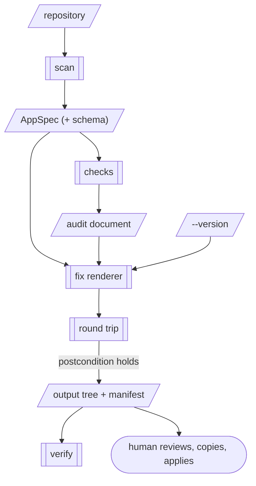

> Adds `fix`, a renderer that turns the audit's row-level-security findings into one new
> Supabase migration file for a human to review and commit. It writes a policy only where
> the repository proves which column identifies a row's owner. Everywhere else it writes
> a marked, inert block and a gap. It applies nothing, and v1 covers RLS only: secrets and
> platform couplings each need an RFC of their own.

## Problem

`audit` tells a user what is wrong. It does not help them fix it, and for the findings
that matter most, the fix is the hard part.

The remedy text in RFC-0002's checks is correct and generic: *"Enable row-level security
on the table and add policies scoped to the row's owner"*, *"Replace `true` with a
condition on the row's owner, for example `auth.uid() = user_id`"*. Acting on it takes
four things the typical reader of the report does not have. They need to know that
policies are additive (permissive policies are OR-ed, so adding a scoped one next to a
`true` one fixes nothing). They need to know that enabling RLS with no policy denies the
app every row. They need to know which column identifies an owner. And they need to know
that a migration already applied is history, so the fix is a *new* migration and never an
edit to the old one. A user who gets any of these wrong either leaves the data open while
believing it closed, or locks their own users out and reverts the whole change.

The evidence that this is common, not hypothetical, is the recall-corpus run from
RFC-0002 (#16, published in aggregate at
<https://devopsgenie.ai/blog/lovable-emergent-apps-audit>). Of 190 public repositories,
125 Lovable and 65 Emergent, 83 Lovable apps were RLS-assessable. Of those 83:

| Finding | Apps |
|---|---|
| A public table with RLS never enabled | 4 |
| An UPDATE, DELETE or ALL policy open to anyone, with a condition of `true` | 18 |
| **Either: anyone can change or delete data** | **20 (24%)** |
| A SELECT policy of `true` for `anon` or `public` | 44 |
| An anonymous INSERT policy of `true` | 33 |

The same run found secret-named build-time variables read by browser code in 15 of 125
Lovable apps (5 of them `service_role` keys), committed credentials in 15 of 65 Emergent
apps, 22 of 125 Lovable apps calling Lovable's AI gateway, and 14 of 65 Emergent apps on
Emergent-managed sign-in. Those numbers bound what a fix generator could eventually cover,
and they are why this RFC starts where it does (see *Scope*).

The last two rows of the table matter as much as the first two. Public reads and
anonymous inserts are *usually intended*: a product catalogue, a waitlist form. A fix
generator that closed everything the audit mentions would break most of the apps it ran
on. Those users would revert the whole migration, including the part that mattered.

RFC-0002 anticipated this RFC: generating fixes *"is the most valuable next step and it is
a renderer. It needs its own RFC and its own golden tests."*

### Two ways a fix can be wrong

RFC-0001 split generator failure into *does not know* and *confident and wrong*. A fix has
both, and the second has two directions.

**It does not know.** Nothing in `public.notes (id, body)` says whose row a note is. No
policy can be written without inventing an ownership model. This case is tractable: the
fix says so, as a gap.

**It is confident and wrong, left open.** The fix adds an owner-scoped UPDATE policy and
leaves the `true` one beside it. PostgreSQL ORs permissive policies, so nothing changes.
The migration applies cleanly, and the user believes the table is closed. This direction
is mechanically checkable, and this RFC checks it on every render (see *Round trip*).

**It is confident and wrong, locked shut.** The fix scopes writes to `user_id`, but the
app inserts rows without setting it, or `user_id` is the *assignee* and a different column
is the owner. Every write from the app now fails. No static check catches this. The
replay has tables and policies but no users. The defence is an evidence rule strict enough
that the fix is rarely confident, and a behavioural test that proves the rule on fixtures
where the truth is known.

## Proposal

A new entrypoint, `fix`, runs `scan` and the audit checks, then passes the AppSpec and
the audit document to a pure renderer. The renderer writes an output tree for a human to
review and copy into the application repository.



The renderer is RFC-0001's renderer in every respect: a pure function, byte-stable, no
clock, no network, no model. It reads no source file. Its target is new: the application's
own database schema, not a deployment. The rules that follow exist to make that target
safe to write for.

### What the renderer must know, and where it lives

A policy that names `owner_id` needs the renderer to know that `owner_id` is the owner.
The renderer may not read `supabase/migrations/` itself (*"renderers never read the source
repository"*), and RFC-0001 is explicit about what that pressure means: *the AppSpec is
missing a field.* So the migration replay becomes a detector, and its result joins the
AppSpec:

```
Datastore
  ...
  schema        Schema?          # new. A postgres datastore whose migrations are in
                                 # the repository. null for every other datastore.

Schema
  migrations    [str]            # replayed, in run order
  unreplayable  [str]            # "path:line: reason". Non-empty means tables is null
  unordered     [str]            # migrations with no leading version; order unknown,
                                 # so tables is null here too
  latest        str?             # highest migration version seen; see Versioning
  tables        [Table]?

Table
  name          str              # "public.tasks". Identity; never answerable
  rls           bool?            # null: altered in these migrations, created elsewhere
  columns       [Column]?        # null when a statement changing columns was not
                                 # understood. Tracked separately from rls: an
                                 # unparseable column change must not cost the RLS
                                 # checks their answer
  policies      [Policy]         # name, command, roles, using, with_check, permissive
  write_scope   WriteScope?      # answerable. null = not determined

Column
  name          str
  nullable      bool
  references    str?             # "auth.users.id", "public.profiles.id"

WriteScope
  kind          owner | server_only
  column        str?             # required for owner; must name one of columns
```

`checks/migrations.py` moves under `detect/` and gains column tracking: column lists in
`create table`, inline and table-level `references`, and `alter table … add column`,
`drop column`, `rename column` and `add constraint … foreign key`. The RLS checks then read
`Schema` from the AppSpec instead of replaying for themselves. That is one replay with two
consumers, so the audit and the fix can never disagree about the schema. It is a
refactor: every `expected_audit/` golden stays byte-identical, and the test suite asserts
that.

`Finding` gains one field, so the renderer can join a finding to its table and policy
without parsing an id. Ids are built with `dns_label`, which is lossy.

```
Finding
  ...
  subject       {str: str}       # new. {"table": "public.tasks",
                                 #       "policy": "Authenticated users can update tasks"}
```

It is additive, and `report.json` keeps schema `offramp.audit/1`, by the precedent
RFC-0001 set for `Answer.accepted_by`. `report.md` does not render it.

### Owner detection: evidence, never names

`write_scope` is detected as `owner` only when **exactly one** column is supported by
evidence, and the evidence agrees:

1. **Policy basis.** An existing policy on the same table has a `using` or `with check`
   expression that normalises to exactly `auth.uid() = <col>`, `<col> = auth.uid()`, or
   either form with `(select auth.uid())`. The app's author has already declared that
   column the owner for some operation. A compound expression (`… or is_admin()`) is not
   evidence.
2. **Foreign-key basis.** Exactly one column references `auth.users.id`. One hop is also
   accepted: a column that references a table whose primary key itself references
   `auth.users.id`, such as `profiles(id)`. That hop is what makes `profile_id` an owner.
   A primary key that references `auth.users.id` counts too, and `profiles.id` is its own
   owner.

If the two bases name different columns, if either names more than one, or if the table
had a column renamed after the policy that would be evidence (the replay stores policy
text, and PostgreSQL rewrites it on rename), nothing is detected. A column *name* such as
`user_id`, `owner_id` or `created_by` is never evidence. It becomes the gap's `proposed`
value at `confidence: medium`, and it is never rendered until a human accepts it.

When `write_scope` is not detected for a table the fix needs, the owner detector emits:

```
Gap
  id          datastore.supabase.table.public.notes.write_scope
  kind        value
  question    Who may change rows in `public.notes`? No column is proven to identify
              a row's owner, so no policy can be written without guessing. Answer with
              the owner column, or `server_only` if only your server should write.
  proposed    null            # or a name-matched column, at medium confidence
  severity    blocking
  evidence    the create-table line, and each candidate with its basis
```

"A table the fix needs" means a public table whose current state leaves writes open: RLS
off, or a permissive write policy of `true`. The predicate is one function, shared with
the check. Asking about every table would add a question per table to every Lovable scan,
and most of those questions would have no consequence. `blocking` follows RFC-0001's
definition: the output for that table does not exist until a human answers. The critical
finding stays open meanwhile, and it is the louder signal.

Answering needs RFC-0001's `show` and `apply`, which do not exist yet. Until they land, v1
renders detected scopes only, and an undetected table gets the inert block below. When
`apply` lands, `write_scope` is already in the answerable set, and answers flow through it
with no change to this renderer. A model may propose an owner column as a `resolve` entry
in a plan. That is the model's role, and the only one it has (AGENTS.md §3).

### What the renderer emits, per finding

The rule behind every row below: **a fix closes exactly the exposure its finding names,
preserves every other behaviour, and turns each remaining decision into a gap.** Anything
that changes behaviour the finding did not name has to be accepted by a human first.

| Finding | Scope | Emitted |
|---|---|---|
| `rls.disabled` | owner | `enable row level security`, owner-scoped INSERT, UPDATE and DELETE `to authenticated`, and a SELECT `using (true)` that preserves today's reads |
| `rls.disabled` | server_only (answered) | `enable row level security` and no policy |
| `rls.disabled` | not determined | inert block: the enable statement commented out, the reason, the gap id |
| `rls.permissive_write`, high (UPDATE, DELETE, ALL) | owner | `drop policy` for the offending one, then an owner-scoped replacement for the same command `to authenticated`. For ALL, the SELECT half is preserved as it was |
| same | server_only (answered) | `drop policy` only |
| same | not determined | inert block and gap |
| `rls.permissive_write`, medium (INSERT only) | — | nothing; listed as "needs your decision" |
| `rls.public_read` | — | nothing; listed as "needs your decision" |

Three consequences of the rule, argued:

- **Reads are preserved when RLS is first enabled.** A table with RLS off is readable by
  anyone today. Nothing records whether that was intended, and in 44 of 83 apps a public
  read *was* declared on purpose. Emitting an owner-only SELECT would break every
  catalogue and every public profile page. The preserved policy is visible and named, and
  after the fix the audit reports it as `supabase.rls.public_read`, the question RFC-0002
  already asks. A critical "anyone can change anything" becomes a medium "confirm that
  anyone may read this". That is exactly the part the tool can decide and the part it
  cannot. See Open question 1.
- **A replacement for an `anon` or `public` policy is granted `to authenticated`.**
  `auth.uid()` is null for an anonymous request, so an owner check granted to `anon` can
  never pass. The change of role is stated in the block's comment.
- **An existing owner-scoped policy for the same command is not duplicated.** The
  offending policy is dropped and nothing is created. The fix is the smallest diff that
  closes the finding.

The generated migration for `fixtures/lovable-vite-supabase`, abridged:

```sql
-- Generated by offramp fix from audit findings. Review every block before applying.
-- Applying this file is your step; offramp applies nothing. After applying, re-run
-- audit: every finding named "fixed" below must be gone.

-- fixed: supabase.rls.permissive_write.public.tasks.authenticated-users-can-update-tasks
-- Owner: owner_id. Evidence: policy "Owners can view their tasks" compares it to
-- auth.uid() (supabase/migrations/20260110093000_init.sql:28).
drop policy if exists "Authenticated users can update tasks" on public.tasks;
create policy "offramp: owner can update" on public.tasks
  as permissive for update to authenticated
  using ((select auth.uid()) = owner_id)
  with check ((select auth.uid()) = owner_id);

-- NOT FIXED: supabase.rls.disabled.public.notes
-- No column of public.notes is proven to identify a row's owner, so no policy is
-- written. Gap: datastore.supabase.table.public.notes.write_scope
-- Enabling row-level security with no policy makes the table unreachable from the
-- app. If only your server uses this table, that is what you want:
--   alter table public.notes enable row level security;
```

Beside it, `FIXES.md` explains in the report's plain register what each block changes for
the app's users. It lists what was deliberately not changed and why, and every gap. It
also notes consequences the schema reveals: an owner column that is nullable, so rows
with no owner become unreachable, and an owner column with no `default auth.uid()`, so the
app must set it on insert. It closes with the manual steps: copy the file, apply it
through the project's usual migration process, and re-run `audit`. `fixes.json` is the
same content for machines: each finding, `fixed | gap | not_in_scope`, and the gap ids.

Identifiers come from the repository and are data. The renderer quotes every identifier
and policy name by PostgreSQL's rules and never interpolates one raw. A table named to
smuggle a statement into the migration renders as an odd name, not as a second
statement. The round trip below also counts statements.

The `offramp:` prefix on created policy names makes the tool's own policies recognisable,
to the user and to the next run. It is the name of the tool that wrote the policy, not a
vendor, the same provenance the report's footer carries.

### Round trip: the renderer checks its own output

Before writing anything, `fix` replays the repository's migrations *plus* the generated
file, in memory, through the same replay, and runs the RLS checks on the result. It
refuses to write (exit `2`) unless all of these hold:

- the combined replay has no statement it could not replay;
- every finding marked `fixed` is gone;
- every finding marked `gap` is still present, so the fix never makes a question
  disappear without an answer. This is why the inert block is a comment and not an
  enabled table with no policy;
- no finding is present that was not present before, except the `public_read` findings
  that the preserved-read policies are expected to raise, which are listed.

This catches the left-open failure by construction. The two-policy OR case leaves the
finding present, and the render fails. It also forces the generated SQL into the replay's
grammar, the six statement forms RFC-0002 fixed, and nothing beyond it. That grammar is
narrower than PostgreSQL's. The round trip proves the file is self-consistent with the
audit, not that PostgreSQL will accept it. The behavioural test below covers that.

### Idempotency, versioning and the output tree

```
python skills/offramp/scripts/fix.py <repository> --out <directory> [--version <n>]
```

```
<out>/
  supabase/migrations/<version>_offramp_rls.sql
  FIXES.md
  fixes.json
  .offramp/manifest.json
```

- **The output is a staging tree, never the repository.** `fix` writes only under
  `--out`. The user copies the migration into `supabase/migrations/`. RFC-0001 treats a
  change to the user's application as a human step. A migration is application code, and
  the copy is that step.
- **Existing migrations are never edited.** An applied migration is history. Rewriting
  the `create policy … true` line would change the repository and leave the live
  database as it was. Every fix is a new file.
- **Versioning without a clock.** The default version is `Schema.latest + 1`. It is
  derived from the repository, sorts after every migration in it, and is identical on
  every run over the same commit. A project whose database has migrations the repository
  lacks passes `--version` at the edge, where RFC-0001's `apply` takes `now`. The version
  is renderer input and is recorded in the manifest.
- **Re-running converges.** Before the file is committed, a re-run is byte-identical.
  After it is committed, the replay includes it, the fixed findings are gone, and a
  re-run emits a file only for what remains, under a new version. At most one migration
  is emitted per run. When nothing remains, nothing is written.
- **Hand edits are refused, not overwritten.** `fix` refuses to clobber a file under
  `--out` whose hash no longer matches `.offramp/manifest.json` (exit `1`, a conflict),
  per RFC-0001.
- **`verify` lands here.** RFC-0001 requires `verify` to land in the same change as the
  first renderer. This is the first renderer, so `verify.py` re-renders into a temporary
  directory and diffs the output tree. The Kustomize renderer reuses it unchanged.

`fix` is a separate script, not `audit --fix`. RFC-0002 and the README promise that
`audit` writes two files and nothing else, and users run it in CI on that promise. A flag
that makes the same command write SQL spends that trust for a shorter command line.

### Build order

This inserts one step after RFC-0002's last one. RFC-0001's order otherwise resumes as
RFC-0002 left it, and `fix` becomes the first renderer, ahead of Kustomize.

1. The replay moves to `detect/`, gains column tracking, and populates `Datastore.schema`.
   The RLS checks read it. `expected_audit/` stays byte-identical.
2. The owner detector and its gap. `Finding.subject`.
3. The fix renderer, its round trip, the manifest, `verify`, and `expected_fix/` goldens.
4. The corpus precision review. The README does not mention `fix` until it passes.
5. The behavioural database test as a separate CI job.

## Alternatives considered

**A model writes the fix.** A model given the finding and the migrations would produce
plausible policies for every table, including `notes`. That is the failure: it would
invent an ownership model where the repository has none, in output bytes, with nothing to
check it against. AGENTS.md §3 forbids a renderer that calls a model, and RFC-0001
confines a model to proposing AppSpec values. Here that means proposing a `write_scope`
through a plan a human accepts, which is exactly where its judgement is useful.

**Apply the fix directly,** through the Supabase management API or a database
connection. The fix would take effect with no copy step and no migration drift. Rejected
by AGENTS.md §2 on every count: it needs a credential and the network, and it mutates a
live system. It is also the one version of this feature that could lock a production app
out with no review in between.

**Open a pull request against the user's repository.** This is the most convenient
surface, and a GitHub App built on this renderer is a natural later product. It needs a
token and the network, so it is a separate service with its own consent model. It is not
part of this tool. The renderer's output tree is designed to be what such a service would
commit.

**Enable RLS with no policies, everywhere.** This is the simplest fix that is never
insecure. Rejected because it is confidently wrong in the locked-shut direction on almost
every app: 44 of 83 read anonymously on purpose. It also turns the audit clean while the
app is broken, so the finding disappears and the question with it.

**Owner from column names.** `user_id` and `owner_id` are right more often than not.
"More often than not" is a guess, and a wrong owner column locks users out or lets one
user edit another's rows, while the audit reports clean. A name keeps its value as the
gap's `proposed` answer, and a human decides.

**Edit the offending migration in place.** This gives a smaller diff and no new file. It
is rejected above: the live database has already run the old text.

**Fixes for secrets and platform couplings in the same RFC.** See *Scope*.

**Do nothing; improve the remedy text.** The remedy already says what to do. Of 83 apps,
20 still let anyone change data. The gap is in *how*, and prose cannot carry the owner
column for a specific table.

## Scope: why RLS only

*"An RFC that changes three things is three RFCs."* The other finding classes are each a
different kind of fix:

- **Secrets** (`frontend.secret_in_bundle`, `credential.committed`). The real fix is
  rotation, which is non-declarative, a runbook step by AGENTS.md §2. It is followed by
  moving the call behind a server-side function. The tool cannot write that function
  without knowing the third-party API's contract, and it would be editing the app's
  frontend code. A scaffold and checklist is plausible, and it deserves its own argument.
- **Platform couplings** (the AI gateway in 22 of 125 Lovable apps, Emergent-managed
  sign-in in 14 of 65 Emergent apps). Replacing an auth provider or a model gateway is a
  migration of the app's code paths and its users. It is the offramp problem itself, not
  a patch.

RLS is different in kind. The fix is declarative, the file format is the project's own
migration, the grammar already exists in the replay, and it is the most common critical
and high finding. This RFC changes three internal things (the replay as a detector,
`Finding.subject`, the renderer), but none of them is useful without the others, and
none changes behaviour outside this feature. Open question 5 asks whether that is one
change.

## Impact on generated output

Additive, and it moves some existing goldens:

- **`expected_bare/appspec.json` and `detected.json`, all five fixtures.** Every
  datastore gains `schema`. It is `null` for MongoDB and for `lovable-no-migrations`.
  For `lovable-dynamic-sql` it records the unreplayable `DO` block with `tables: null`,
  which is what keeps its RLS checks at `could_not_assess`. `scan.json` hashes move with
  them.
- **Gap counts.** `lovable-vite-supabase` gains one blocking gap, for `public.notes`.
  `public.tasks` is detected through its owner-scoped SELECT policy and asks nothing.
  `gap_count.json` moves by exactly that, and this RFC is the justification RFC-0001's
  gate requires. No Emergent fixture's gap count moves.
- **`expected_audit/report.json`.** Findings gain `subject`. `report.md` does not change.
- **New `expected_fix/`** for each Lovable fixture, including an empty-output case, and a
  new fixture (below).

Someone who ran `audit` before sees the same report plus one field. Nothing they already
have is rewritten.

## Testing

- **Golden output trees.** `expected_fix/` per fixture, byte-stable, as `expected_bare/`
  is.
- **Ground truth for owners.** `truth.yaml` gains `write_scope:` per relevant table, hand
  written: the column, or `undetermined`. CI asserts 100% agreement. A detector that
  starts guessing from names fails here even as the gap count falls. That is RFC-0001's
  argument for `truth.yaml`, applied to the one field where a guess is most expensive.
- **A new fixture, `lovable-rls-owners`,** carrying the awkward cases on purpose: a
  table with RLS off and an inline `references auth.users` column (a full fix); an ALL
  `true` policy on a table owned through `profiles(id)` (one hop, with the SELECT half
  preserved); two FK candidates (a gap listing both); a policy basis contradicting an FK
  basis (a gap); a column renamed after the policy that named it (a gap); a nullable owner
  (fixed, with the note); an existing owner-scoped UPDATE beside a `true` one (drop only);
  and an anonymous INSERT `true` (untouched).
- **Round trip, as a unit test and a postcondition.** The four conditions above are
  asserted on every fixture. A deliberately broken renderer, one that adds without
  dropping, must make `fix` exit `2`.
- **Hostile identifiers.** A fixture table and policy whose names contain quotes,
  semicolons and comment markers. The rendered file replays to exactly the intended
  statements.
- **Behaviour on a real database.** A separate CI job, not in `make check`, starts a
  disposable PostgreSQL with a stub `auth` schema (`auth.users`, and `auth.uid()` reading
  a session setting). It applies each fixture's migrations and then the generated one,
  and asserts behaviour as two users and as `anon`. The owner can update their row,
  another user cannot, reads are unchanged, and every `NOT FIXED` table behaves exactly as
  before. This is the only test that catches the locked-shut failure. It is also the only
  one that proves PostgreSQL, not just the replay, accepts the file.
- **Determinism.** Two renders of the same input are byte-identical. No test sets a
  clock, because none is read.
- **Values never appear.** The fix consumes schema identifiers only. Existing fixtures
  with a `service_role` key and a sensitive `VITE_` value assert that neither appears in
  any file under `--out`.
- **Precision on the corpus before any claim.** `fix` runs over the 83 RLS-assessable
  Lovable apps in the referenced-never-copied corpus. The PR reports, in aggregate only,
  how many RLS findings got an executable fix and how many got a gap. It also reports a
  hand-labelled sample of detected owner columns, each checked by reading the app's code
  for how rows are written. A single wrong owner in the sample blocks release until the
  evidence rule is tightened. For this feature a false positive is not a noisy report; it
  is a lockout. No repository is named, per RFC-0002. The fraction that gets a fix is
  unknown today, and this RFC claims none.

## Declarative constraint

This proposal complies. `fix` reads files and writes files under a directory the user
names. It applies no migration, opens no database connection, needs no credential, and
makes no network request. The act of changing the database is written into `FIXES.md` as
a step for a human, which is AGENTS.md §2's rule for non-declarative work.

One test needs arguing: the behavioural job starts a PostgreSQL container and applies
migrations to it. That is validation of generated output in a disposable local
environment. It is the same class as the `docker build` and "the image starts and answers
its own probe" checks RFC-0001 already permits, and it touches nothing real. It runs only
in CI, never inside `fix`, and it is not a product feature. `fix` gains no mode that
applies anything, not even to a local database. A tool that can apply to one database can
be pointed at another.

## Out of scope

- **Secrets and platform couplings.** Each a later RFC; see *Scope*.
- **INSERT-only `true` policies and public reads.** These are decisions, not defects, and
  the report keeps asking. A later RFC could let an accepted answer silence them.
- **Ownership that is not a column,** such as team membership, a join table, or a policy
  referring to another table. The gap stays open, and the user writes that policy.
- **Tables, policies and storage rules created outside migrations.** They are invisible,
  as in RFC-0002.
- **Answering gaps before `show` and `apply` exist.** v1 renders detected scopes only.
- **Applying anything, and opening pull requests.**
- **Down migrations and rollback files.** Supabase migrations are forward-only. `FIXES.md`
  names the policies a revert would restore.
- **Firebase rules** and other scenarios.

## Open questions

1. **Preserving reads.** When RLS is first enabled, the fix keeps today's anonymous reads
   and lets the audit ask about them as `public_read`. The alternative is owner-only reads
   plus a second gap. That is safer for private data like `notes`, and it breaks every
   public catalogue until someone answers. Which default?
2. **Version default.** Is `Schema.latest + 1` right, or should `--version` be required?
   It avoids the clock and is stable, but it sorts before a migration the remote database
   holds and the repository does not, and the Supabase CLI refuses by default to push a
   migration older than the remote's latest.
3. **Policy names.** Is `offramp:` in a policy name that lives in the user's database for
   years acceptable provenance, or should names be neutral (`owner can update`), with
   recognition done by the manifest alone?
4. **The behavioural job.** It pulls a PostgreSQL image. Should it gate merges, or run as
   a required check only on changes under `detect/` and the fix renderer?
5. **One RFC or two.** The replay-as-detector and owner detection change the AppSpec for
   every scenario. They could land first under their own RFC, with this one reduced to the
   renderer. Reviewers should decide whether that split is real or ceremonial.
